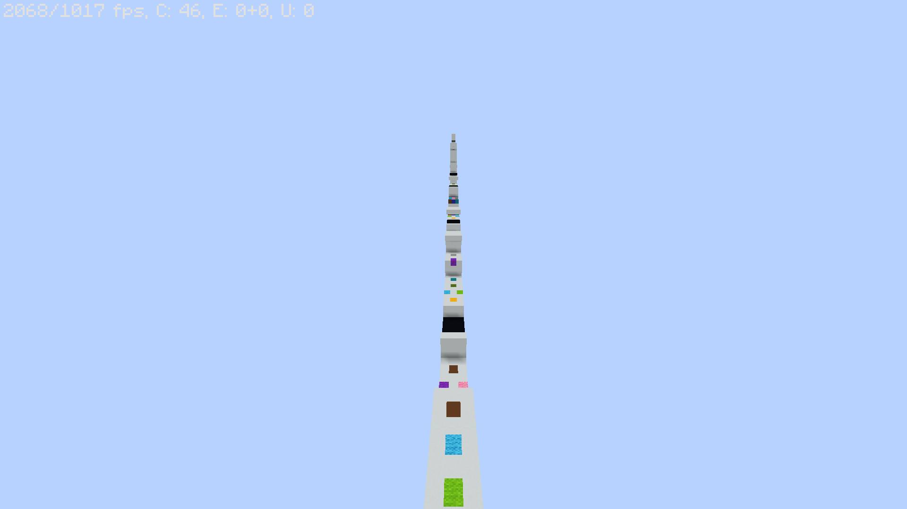

# Sequor
Sequor is a minecraft puzzle parkour map with a unique take on powerup parkour. Throughout the map, you will be picking up powerups, but they will only activate in order! The map contains 7 levels, with the first few being pretty easy and the last few being quite difficult. The map should take around 30 minutes to an hour and a half to play through.

## Versions
This map is designed for 1.14.x, and it will **not** work on any prior versions.

## Download
To download the map, go to [https://github.com/MrYurihi/sequor/releases/latest](https://github.com/MrYurihi/sequor/releases/latest).
You will see a button where you can download `Sequor.zip`. Download the zip, then extract it into your [minecraft save directory](https://help.mojang.com/customer/portal/articles/1480874-where-are-minecraft-files-stored-).

## Recording
You are allowed to record footage of playing this map, but you must link to [https://github.com/MrYurihi/sequor](https://github.com/MrYurihi/sequor#Sequor).

## Pictures

## Bugs
If you do happen to find a bug, you can report it on the issues tab of this repo. I will try to fix it as soon as I can.  
I have tested all of the levels and they are possible.  
If you get stuck in a level, as a last resort you can run `/function sequor:map/actions/reset_powers_checkpoint` to go back to your last checkpoint (as if you had stepped on black concrete)
